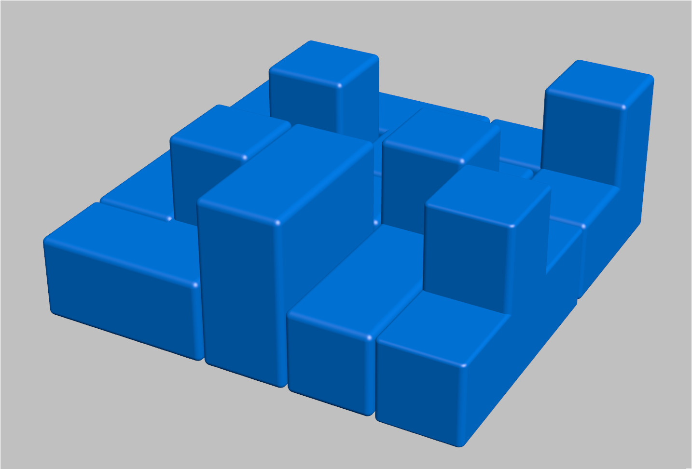
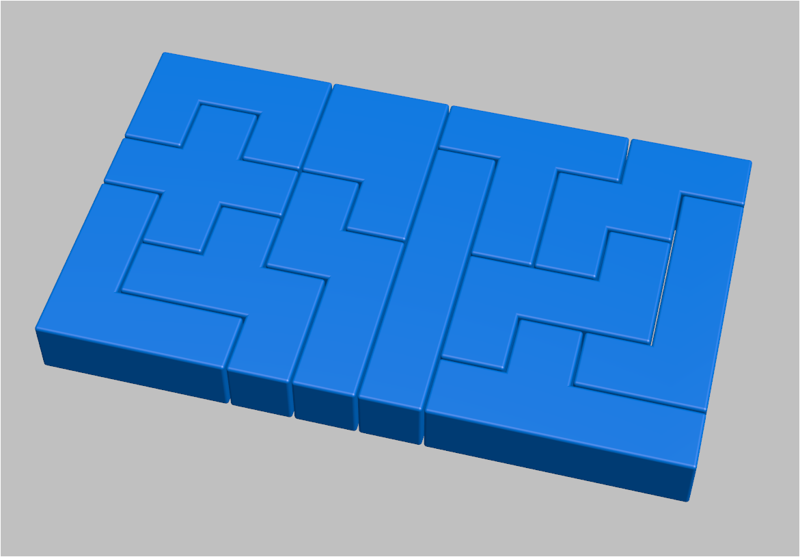

# Pentomino Project by SML-Corp

Pentomino（ペントミノ）および Tetracube（テトラキューブ）のデータ公開ページです。

## ペントミノ攻略本のサンプル

ペントミノはかなり難しいので、長続きしません。6X10の箱に入れる問題の場合、答えは2,339通りも有りますが、答えにならない組み合わせが山ほどあるので、仕方ありません。
2,339通りの答えはPythonと言うプログラミング言語を使って解きました。その答えから、2,339通りの問題集を作りました。問題集は、詰将棋の様になっています。下記は問題のひとつです。

| ファイル名                          | 形式  |                                                       リンク                                                       |
| :----------------------------- | :-: | :-------------------------------------------------------------------------------------------------------------: |
| Pentomino Quest Sample Edition | PDF | [📥 Download](./00.documents/Pentomino%20Quest%20release%202025_05_19/Pentomino%20Quest%20Sample%20Edition.pdf) |

## 04. 3D Models (STL)
- **Tetracube 16種類セット** [📦 ZIPファイルをダウンロード](./02.Tetracube/Tetracube_16.zip)
- **Pentomino 14Dセット** [📦 ZIPファイルをダウンロード](./Pentomino/Pentomino14D.zip)

## 01. Tetracube (16㎜)

- **内容:** ８種類のテトラキューブ・モデル 1辺のサイズが16mmです。
- **配布データ:** [Tetracube_16.zip](./02.Tetracube/Tetracube_16.zip)
- **STLファイル:** 02.Tetracube/Tetracube_16 フォルダ内に同梱

## 02. Pentomino (14D)

- **内容:** 12 ピースのペントミノ・パズル
- **配布データ:** [Pentomino14D.zip](./Pentomino/Pentomino14D.zip)

## 03. Documents
